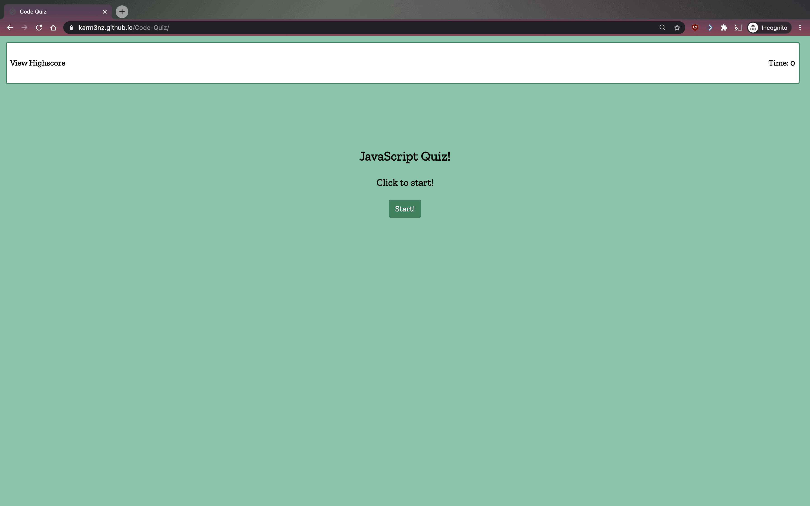
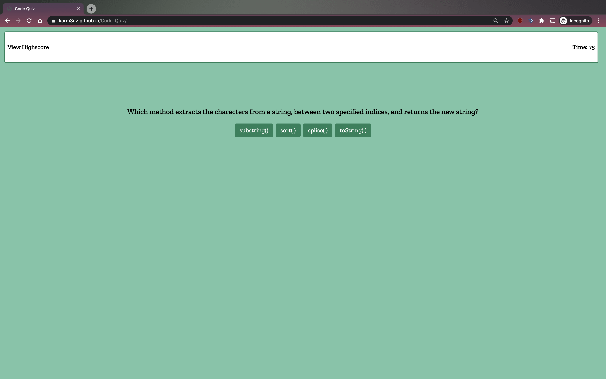
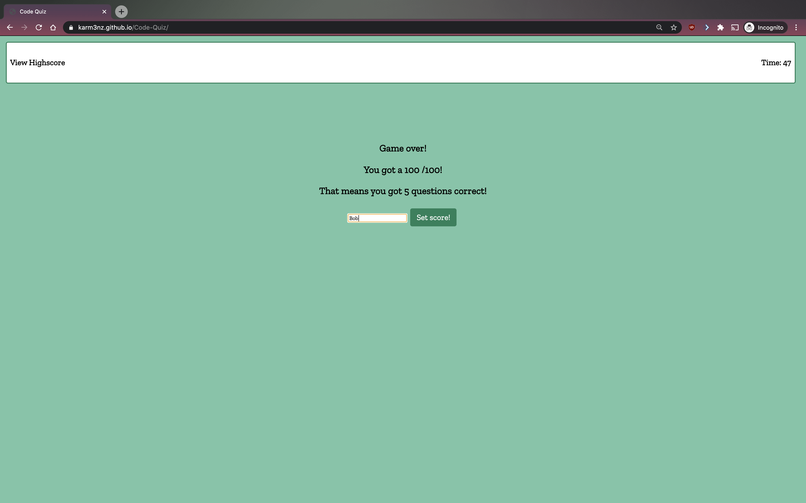
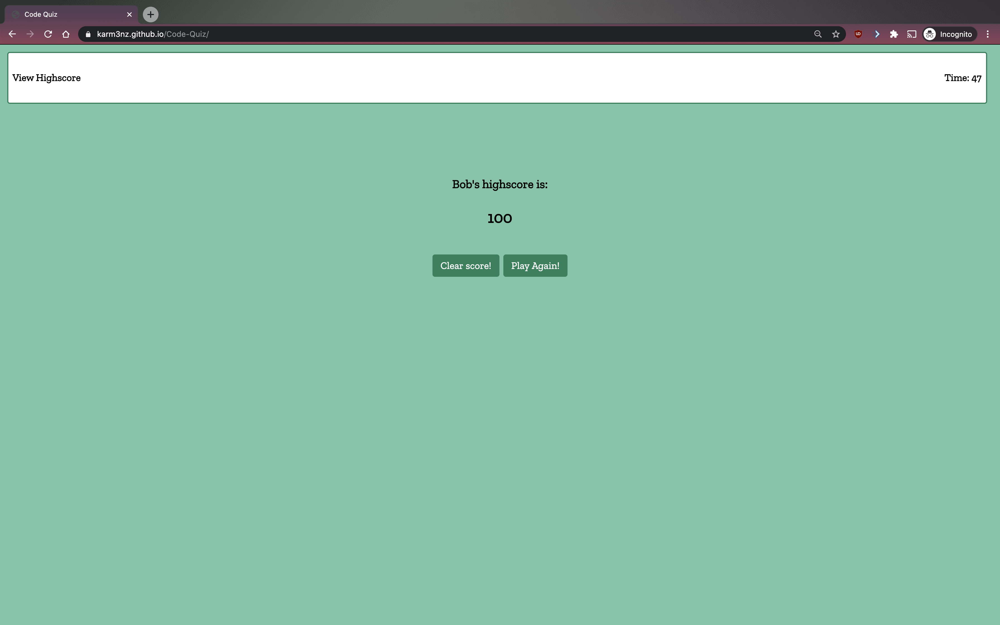

# Code Quiz

## Description 

Let it be preparation for an interview, to making sure that you have the basic fundamental knowledge down, a code quiz can offer support in all these areas! This quiz does exactly just that for Javascript fundamental questions on functions, array, and string methods.

Some of the features of this code quiz is that it displays a countdown timer at the start of quiz, tallys score of the use based on how many questions are correctly answered, as well as how fast the user answers the questions, and stores/clears highscore in local storage.

From this project I learned that there are vastly different ways of arriving to the same outcome. Some paths make it less likely to encounter errors, are easier to read, while others are albeit a bit harder to read, display the functions to be executed from a different perspective. Due to time constraint, I've learned to make a list of projects to revisit exploring other methods to arrive to the same outcome.  

## Table of Contents

* [Installation](#installation)
* [Usage](#usage)
* [Credits](#credits)
* [License](#license)

## Installation

1) Make sure to have properly functioning computer.
2) Check if an internet browswer is installed. If so, go to step 4).
3) Install an internet browser of your choice. 
4) Open up internet web browser.
5) In the address bar, type in :  https://karm3nz.github.io/Code-Quiz/ and hit "enter" on the keyboard.

## Usage 

Provide instructions and examples for use. Include screenshots as needed. 

To arrive at the Code Quiz webpage, type in :  https://karm3nz.github.io/Code-Quiz/ on the address bar on the web browser and hit the "enter" key.

At the home page, the start button is displayed to begin the quiz (click the start button to begin quiz). After beginning the quiz, first question is displayed. User can click on the following answers to answer each question, and to prompt the next question.

After the user finishes the quiz, the user will be prompted to enter their name to set their score.

Once the score is set, the user can choose to clear their score and/or start the quiz again.

## Credits

### Links to Tutorials/References Reffered to on Project:

Build A Quiz App With JavaScript (video):
https://www.youtube.com/watch?v=riDzcEQbX6k

Code Quiz:
https://github.com/wendyhub/code-quiz

How to Make a Simple JavaScript Quiz:
https://www.sitepoint.com/simple-javascript-quiz/

## License

MIT License

Copyright (c) [2020] [Carmen Hui]

Permission is hereby granted, free of charge, to any person obtaining a copy
of this software and associated documentation files (the "Software"), to deal
in the Software without restriction, including without limitation the rights
to use, copy, modify, merge, publish, distribute, sublicense, and/or sell
copies of the Software, and to permit persons to whom the Software is
furnished to do so, subject to the following conditions:

The above copyright notice and this permission notice shall be included in all
copies or substantial portions of the Software.

THE SOFTWARE IS PROVIDED "AS IS", WITHOUT WARRANTY OF ANY KIND, EXPRESS OR
IMPLIED, INCLUDING BUT NOT LIMITED TO THE WARRANTIES OF MERCHANTABILITY,
FITNESS FOR A PARTICULAR PURPOSE AND NONINFRINGEMENT. IN NO EVENT SHALL THE
AUTHORS OR COPYRIGHT HOLDERS BE LIABLE FOR ANY CLAIM, DAMAGES OR OTHER
LIABILITY, WHETHER IN AN ACTION OF CONTRACT, TORT OR OTHERWISE, ARISING FROM,
OUT OF OR IN CONNECTION WITH THE SOFTWARE OR THE USE OR OTHER DEALINGS IN THE
SOFTWARE.
